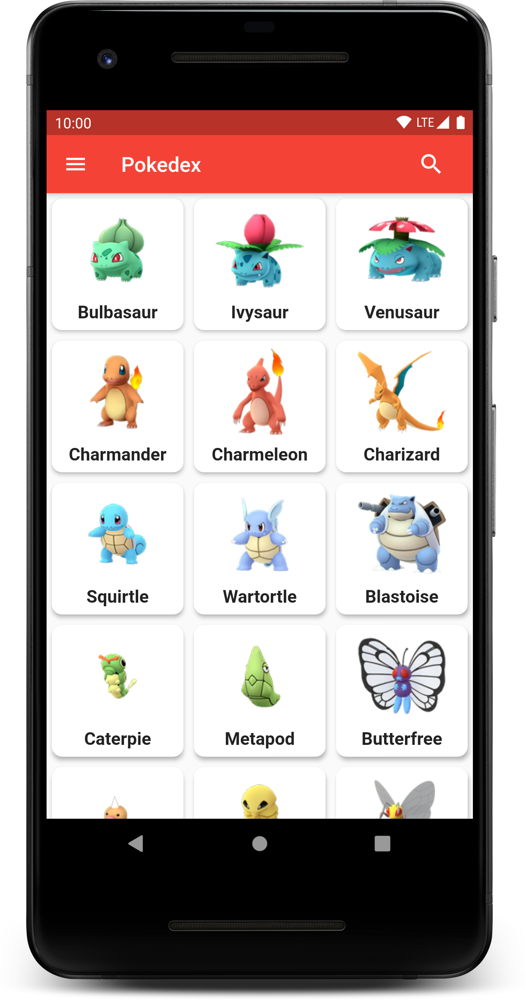
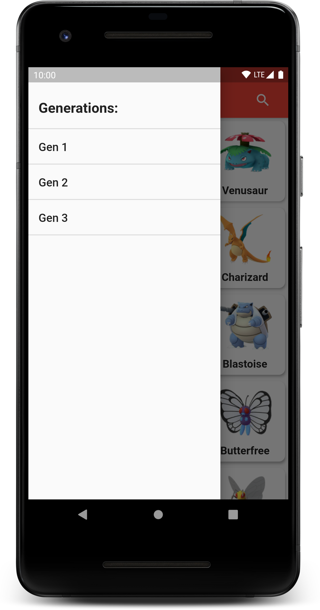
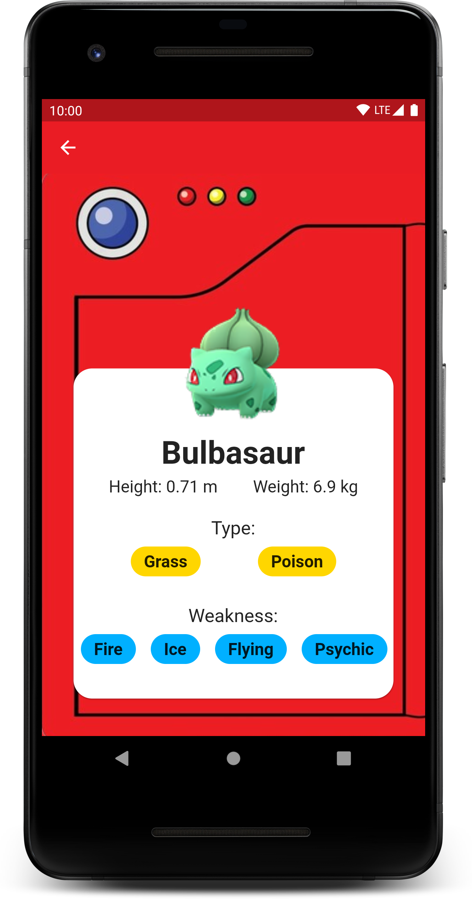
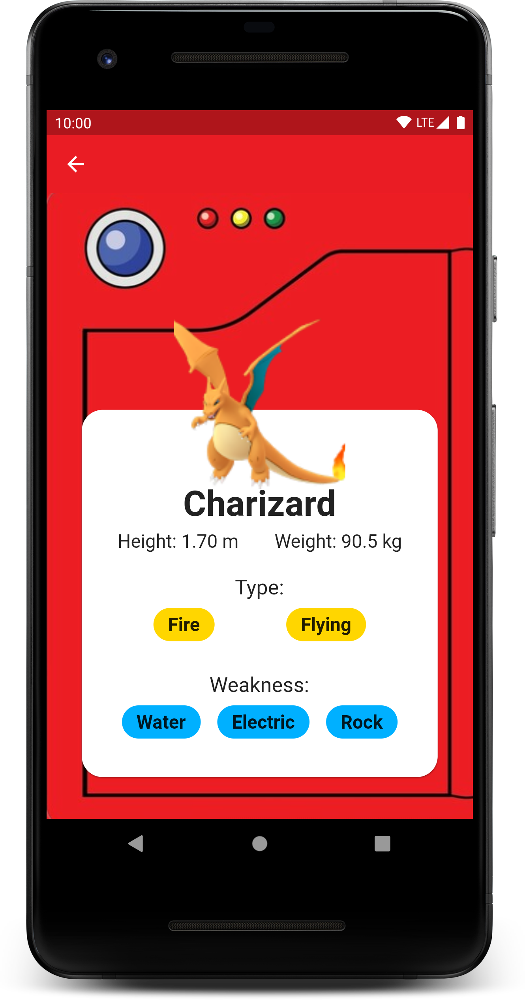
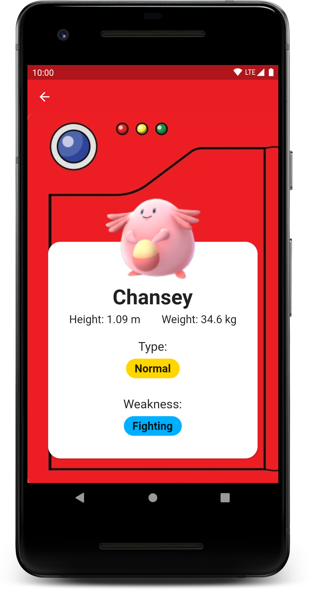

# Pokedex

This is one of my initial projects in flutter. The goal was to learn and practice the basics of flutter. Learned how to use Layout widgets and fetch data from APIs.

## Description

A Pokedex app of popular anime **Pokemon** which contains list of pokemons sorted by generations, along with their detailed Stats.

## ScreenShots 📷

    

## Technology Stack and Others

- Flutter
  - http: ^0.12.2
  - cached_network_image: ^2.3.3
- Pokemon API
- VS Code

## Resourses

- [Lab: Write your first Flutter app](https://flutter.dev/docs/get-started/codelab)
- [Cookbook: Useful Flutter samples](https://flutter.dev/docs/cookbook)
- [Online Documentation](https://flutter.dev/docs)

## Contributors

**Maintainer:** [Siddhant Chogle](https://github.com/SiddhantChogle)

## License

Project is published under the [MIT license](/LICENSE.md).

Feel free to ⭐ and fork Repo to modify/bug fix/improve the code as you want.
